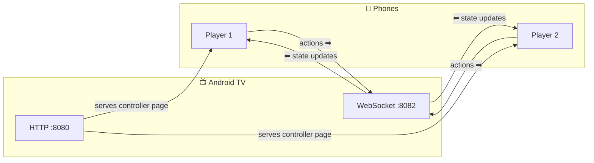
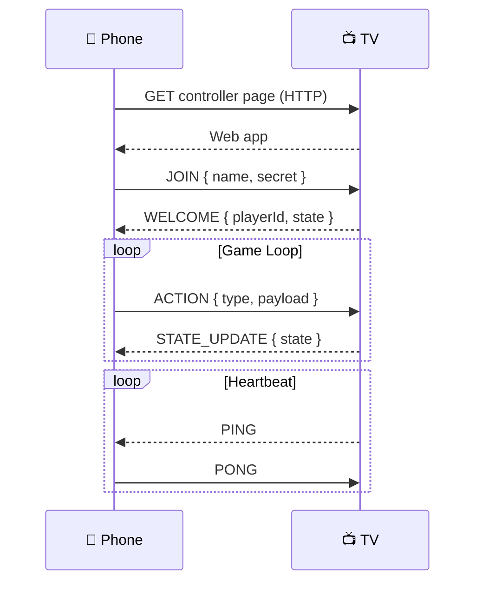
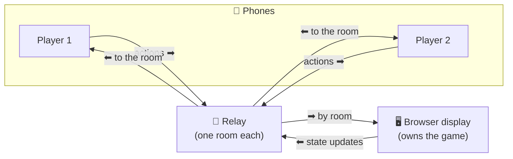
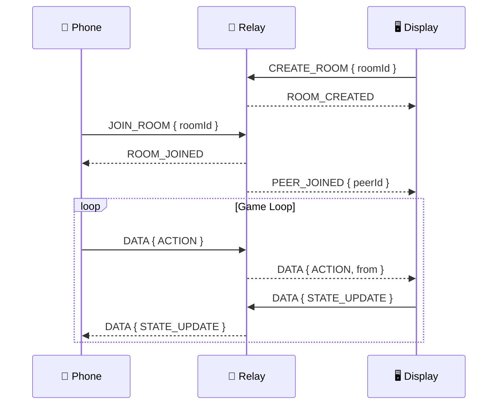

# 🎮 Couch Kit

Turn an Android TV / Fire TV into a local party-game console and use phones as web controllers.

[](https://github.com/faluciano/react-native-couch-kit/actions/workflows/ci.yml)
[](https://github.com/faluciano/react-native-couch-kit/actions/workflows/release.yml)


[](https://www.npmjs.com/package/@couch-kit/host)
[](https://www.npmjs.com/package/@couch-kit/client)
[](https://www.npmjs.com/package/@couch-kit/core)
[](https://www.npmjs.com/package/@couch-kit/display)
[](https://www.npmjs.com/package/@couch-kit/runtime)
[](https://www.npmjs.com/package/@couch-kit/cli)
[](https://www.npmjs.com/package/@couch-kit/devtools)

---

## ✨ Features

- **Local-first:** TV runs HTTP (controller) + WebSocket (game) on your LAN.
- **TV-as-server:** Single source of truth lives on the TV.
- **Or play cross-network:** a browser display owns the game and phones join by
  room code through a small, game-agnostic relay — same reducer, no LAN needed.
- **Shared reducer:** One reducer shared between host + controller.
- **Time sync + preloading:** Helpers for timing-sensitive games and heavy assets.
- **Session recovery:** Players automatically get their state back after refreshing or reconnecting.
- **Dev workflow:** Iterate on the controller without constantly rebuilding the TV app.

## How It Works

### LAN mode (default)

The TV serves the controller and owns the game; phones connect to it directly.





### Relay mode (cross-network)

A browser display owns the game. Phones reach it by room code, so nobody needs
to share a network. The relay only routes by room — it never inspects payloads.



The same game protocol runs inside relay envelopes, so the reducer is unchanged:



## Prerequisites / Supported

- **Devices:** Android TV / Fire TV (host), or any browser as the display. Phones run any modern mobile browser (client).
- **Network:** LAN mode needs TV + phones on the same Wi-Fi. Relay mode does not — see [Two ways to play](#two-ways-to-play).
- **Ports:** LAN mode uses `8080` (HTTP) and `8082` (WebSocket) on the LAN (configurable).
- **Native deps:** `@couch-kit/host` requires Expo modules and React Native native modules; it is not a pure-JS package.

## Two ways to play

Both run the **same reducer**; only who hosts the runtime and how phones reach it differ.

| | LAN (default) | Relay (cross-network) |
| --- | --- | --- |
| Display | Android TV app (`@couch-kit/host`) | Any browser (`@couch-kit/display`) |
| Runtime owner | the TV | the browser display |
| Phones reach it via | direct WebSocket on the LAN | room code through a relay |
| Same Wi-Fi required | yes | no |
| Extra infrastructure | none | one relay deployment, shared by every game |

Relay mode is opt-in: pass `createRelayTransport({ url, roomId })` to `useGameClient`
and run the display with `RelayDisplayHost`. The relay `url` is **required config
with no default** — the SDK never routes your players through someone else's
server. Two implementations ship in `services/`: a Cloudflare Worker
(`relay-worker`, one Durable Object per room) and a single-process Bun server
(`relay`) for self-hosting.

## Non-goals

- Matchmaking or lobby discovery — relay rooms are reached by a code you share, not browsed
- Anti-cheat, account systems, payments
- Hard security guarantees on untrusted networks

---

## 🚀 Usage Guide (Published Library)

> **Starter Project:** The fastest way to get started is to clone the [Buzz](https://github.com/faluciano/buzz-tv-party-game) starter project — a fully working buzzer game that demonstrates the complete `@couch-kit` setup (shared reducer, TV host, phone controller, build pipeline). Use it as a starting point for your own game.

### Example Apps

| App                                                               | Description                                                                                    | Complexity   |
| ----------------------------------------------------------------- | ---------------------------------------------------------------------------------------------- | ------------ |
| [Buzz](https://github.com/faluciano/buzz-tv-party-game)           | Minimal buzzer party game                                                                      | Starter      |
| [Domino](https://github.com/faluciano/domino-party-game)          | Dominos with hidden hands                                                                      | Intermediate |
| [Card Game Engine](https://github.com/faluciano/card-game-engine) | JSON-driven card game engine (blackjack, poker, UNO) with expression evaluator and seeded PRNG | Advanced     |

This guide assumes you are using the published `@couch-kit/*` packages from npm.

### 1. Installation

> **Prerequisite:** You need an existing React Native TV application (Expo with TV config or `react-native-tvos`). If you don't have one yet, clone the [Buzz starter](https://github.com/faluciano/buzz-tv-party-game) — it's a complete working project you can build on.

Install the library packages into your TV app:

```bash
# For the TV App (Host)
bun add @couch-kit/host @couch-kit/core

# Install required peer dependencies
npx expo install expo-file-system expo-network
bun add react-native-nitro-modules
```

If you are setting up the Web Controller manually (instead of using the CLI in Step 4):

```bash
# For the Web Controller (Client)
bun add @couch-kit/client @couch-kit/core
```

### 2. The Game Logic (Shared)

Define your game state and actions in a shared file (e.g., `shared/types.ts`). This ensures both your TV Host and Web Controller agree on the rules.

```typescript
import { IGameState, IAction } from "@couch-kit/core";

export interface GameState extends IGameState {
  score: number;
}

// Only define your own game actions.
// System actions (HYDRATE, PLAYER_JOINED, PLAYER_LEFT, PLAYER_RECONNECTED,
// PLAYER_REMOVED) are handled automatically by createGameReducer.
export type GameAction = { type: "BUZZ" } | { type: "RESET" };

export const initialState: GameState = {
  status: "lobby",
  players: {}, // Managed automatically
  score: 0,
};

// Your reducer only handles your own actions.
// Player tracking and state hydration are handled by the framework.
export const gameReducer = (
  state: GameState,
  action: GameAction,
): GameState => {
  switch (action.type) {
    case "BUZZ":
      return { ...state, score: state.score + 1 };
    case "RESET":
      return { ...state, score: 0 };
    default:
      return state;
  }
};
```

### 3. The Host (TV App)

In your React Native TV app (using `react-native-tvos` or Expo with TV config):

```tsx
import { GameHostProvider, useGameHost } from "@couch-kit/host";
import { gameReducer, initialState } from "./shared/types";
import { Text, View } from "react-native";

export default function App() {
  return (
    <GameHostProvider config={{ reducer: gameReducer, initialState }}>
      <GameScreen />
    </GameHostProvider>
  );
}
```

> **Tip:** On Android, APK-bundled assets live inside a zip archive and cannot be served directly. Use the `staticDir` config option to point to a writable filesystem path where you've extracted the `www/` assets at runtime. See the [Buzz starter](https://github.com/faluciano/buzz-tv-party-game) for a working example with `useExtractAssets()`.

```tsx
function GameScreen() {
  const { state, serverUrl, serverError } = useGameHost();

  return (
    <View>
      {serverError && <Text>Server error: {String(serverError.message)}</Text>}
      <Text>Open on phone: {serverUrl}</Text>
      <Text>Score: {state.score}</Text>
    </View>
  );
}
```

### 4. The Client (Web Controller)

Scaffold a web controller for players to run on their phones:

```bash
bunx couch-kit init web-controller
```

In `web-controller/src/App.tsx`:

```tsx
import { useGameClient } from "@couch-kit/client";
import { gameReducer, initialState } from "../../shared/types";

export default function Controller() {
  const { state, sendAction } = useGameClient({
    reducer: gameReducer,
    initialState,
  });

  return (
    <button onClick={() => sendAction({ type: "BUZZ" })}>
      BUZZ! (Score: {state.score})
    </button>
  );
}
```

## Contracts (Read This Once)

- **System actions are automatic:** The framework uses internal action types (`__HYDRATE__`, `__PLAYER_JOINED__`, `__PLAYER_LEFT__`, `__PLAYER_RECONNECTED__`, `__PLAYER_REMOVED__`) under the hood. These are handled automatically by `createGameReducer` -- you do **not** need to handle them in your reducer.
- **State updates:** The host broadcasts full state snapshots. The client applies them automatically via hydration.
- **Session recovery is automatic:** When a player refreshes or reconnects, the library restores their previous player data automatically. Player IDs are stable across reconnections — the same device always gets the same `playerId`. Disconnected players are cleaned up after a timeout (default: 5 minutes).
- **Dev-mode WebSocket:** if the controller is served from your laptop (Vite), `useGameClient()` will try to connect WS to the laptop by default. In dev, pass `url: "ws://TV_IP:8082"`.

## Dev Workflow (Controller on Laptop)

On the TV host:

```tsx
<GameHostProvider
  config={{
    reducer: gameReducer,
    initialState,
    devMode: true,
    devServerUrl: "http://192.168.1.50:5173",
  }}
>
  <GameScreen />
</GameHostProvider>
```

On the controller (served from the laptop), explicitly point WS to the TV:

```ts
useGameClient({
  reducer: gameReducer,
  initialState,
  url: "ws://192.168.1.99:8082", // TV IP
});
```

---

## 🛠️ Contributing / Local Development

If you want to contribute to `couch-kit` or test changes locally before they are published, follow these steps.

### 1. Setup the Monorepo

Clone the repository and install dependencies:

```bash
git clone https://github.com/faluciano/react-native-couch-kit.git
cd react-native-couch-kit
bun install
```

### 2. Building the Libraries

The packages (`core`, `runtime`, `client`, `host`, `cli`, `devtools`) are located in `packages/*`. You can build them all at once:

```bash
bun run build
```

Or individually:

```bash
bun run --filter @couch-kit/host build
```

### 3. Running Tests

Run all tests across all packages:

```bash
bun run test
```

Run linting and type checking:

```bash
bun run lint
bun run typecheck
```

#### Coverage

Coverage is enforced in CI. The gate runs each package's tests with coverage,
counts only that package's own `src/` (workspace imports of `@couch-kit/*` are
excluded), and fails if any package drops below its floor:

```bash
bun run coverage            # enforce floors (used in CI)
bun run scripts/check-coverage.ts --report   # print numbers without failing
```

Current own-`src/` coverage (lines / functions):

| Package     | Lines    | Functions |
| ----------- | -------- | --------- |
| `core`      | ~85%     | ~91%      |
| `runtime`   | ~100%    | ~96%      |
| `client`    | ~36%     | ~75%      |
| `host`      | ~100%    | ~93%      |
| `cli`       | ~67%     | ~73%      |
| `devtools`  | ~99%     | ~83%      |
| **overall** | **~83%** | **~91%**  |

Floors live in `scripts/check-coverage.ts` — ratchet them up as coverage
improves; never lower them without a good reason.

### 4. Code Style

The project uses [Prettier](https://prettier.io/) for formatting (configured in `.prettierrc`) and [ESLint](https://eslint.org/) for linting.

### 5. Testing in a Real App (Yalc)

To test your local changes in a real React Native app, we recommend using `yalc`. It simulates a published package by copying build artifacts directly into your project, avoiding common Metro Bundler symlink issues.

**First, publish local versions:**

```bash
# In the root of couch-kit
bun global add yalc
bun run build

# Publish each package to local yalc registry
cd packages/core && yalc publish
cd ../runtime && yalc publish
cd ../client && yalc publish
cd ../host && yalc publish
```

**Then, link them in your consumer app:**

```bash
cd ../my-party-game
yalc add @couch-kit/core @couch-kit/runtime @couch-kit/client @couch-kit/host
bun install
```

> **Note:** We do not use the `--link` flag. Keeping the default `file:` protocol ensures files are copied _inside_ your project root, which allows Metro Bundler to watch them correctly without extra configuration.

**Iterating:**

When you make changes to the library:

1. Run `bun run build` in the library repo.
2. Run `yalc push` in the modified package folder (e.g., `packages/host`).
3. Your game app should hot-reload automatically.

**Troubleshooting:**

- **Duplicate React / Invalid Hook Call:** Ensure your library packages treat `react` as a `peerDependency` and do not bundle it. `yalc` handles this correctly by default.
- **Changes not showing up?** If you add new files or exports, Metro might get stuck. Stop the bundler and run:

  ```bash
  bun start --reset-cache
  ```

---

## 📦 Architecture

| Package                   | Purpose                                                                                            |
| ------------------------- | -------------------------------------------------------------------------------------------------- |
| **`@couch-kit/core`**     | Shared TypeScript types, reducer utilities, and protocol definitions.                              |
| **`@couch-kit/runtime`**  | Owns authoritative game state, sessions, authorization, and transport-neutral protocol processing. |
| **`@couch-kit/host`**     | React Native adapter that provides the LAN WebSocket/static servers and renders the TV display.    |
| **`@couch-kit/client`**   | Runs on the phone browser. Connects to the host and renders the controller UI.                     |
| **`@couch-kit/display`**  | Browser display that owns the runtime and reaches phones through the relay (`RelayDisplayHost`).   |
| **`@couch-kit/cli`**      | CLI tools to scaffold, bundle, and simulate web controllers.                                       |
| **`@couch-kit/devtools`** | Optional debug overlay component for web controllers.                                              |

Not published, but part of the repo:

| Service | Purpose |
| --- | --- |
| **`services/relay-worker`** | The relay on Cloudflare Workers — one Durable Object per room. What Couch Kit runs. |
| **`services/relay`** | The same relay as a single-process Bun server: reference implementation and self-host option. |

## 🔄 Release Flow

This repo uses [Changesets](https://github.com/changesets/changesets) for versioning and publishing.

### How it works

1. **Every PR** must include a changeset (`bun changeset` to create one)
2. On merge to `main`, the release workflow either:
   - Creates a **"Version Packages"** PR if there are pending changesets
   - **Publishes to npm** if the version PR was merged (no pending changesets)
3. Consumer app repos ([domino](https://github.com/faluciano/domino-party-game), [buzz](https://github.com/faluciano/buzz-tv-party-game), [card-game-engine](https://github.com/faluciano/card-game-engine)) use **[Renovate](https://docs.renovatebot.com/)** to pick up new `@couch-kit/*` releases and open update PRs automatically

### Dogfooding consumers

Each consumer repo has a `renovate.json` scoped to the `@couch-kit/*` packages (grouped into a single PR). Renovate regenerates the Bun lockfile, then each repo runs its own CI (typecheck + build) on the PR. Patch/minor/digest updates that pass CI are auto-merged by Renovate; **major version bumps** skip auto-merge and require manual review, so breaking changes surface as a held PR in each app.

> Renovate (not Dependabot) is used because Dependabot does not regenerate Bun workspace lockfiles, which causes `bun install --frozen-lockfile` to fail in CI.

## 📚 Documentation

- [API Reference (TypeDoc)](https://faluciano.github.io/react-native-couch-kit/) — full generated API docs
- [Host Documentation](./packages/host/README.md)
- [Client Documentation](./packages/client/README.md)
- [Core Documentation](./packages/core/README.md)
- [Runtime Documentation](./packages/runtime/README.md)
- [CLI Documentation](./packages/cli/README.md)
- [Devtools Documentation](./packages/devtools/README.md)

## Troubleshooting

- Phone can’t open the controller page: confirm TV and phone are on the same Wi‑Fi; verify `serverUrl` is not null.
- Phone opens page but actions do nothing: check that your reducer handles your custom action types and the host isn’t erroring.
- Dev mode WS fails: pass `url: "ws://TV_IP:8082"` to `useGameClient()`.
- Connection is flaky: enable `debug` in host/client and watch logs; keep the TV from sleeping.

## Security Notes

- The controller URL is reachable to anyone on the same LAN. Don’t run this on untrusted Wi‑Fi.
- `JOIN` requires a `secret` field — a persistent session token stored in the client's `localStorage`. The library uses it internally for session recovery. The raw secret is never broadcast to other clients; only a derived public `playerId` is shared in game state.
- The host rejects internal action injection, rate-limits actions (60/sec), ignores actions from clients that haven't `JOIN`ed, and discards inbound messages larger than 256 KiB (configurable via `maxMessageBytes`) to bound memory usage.
